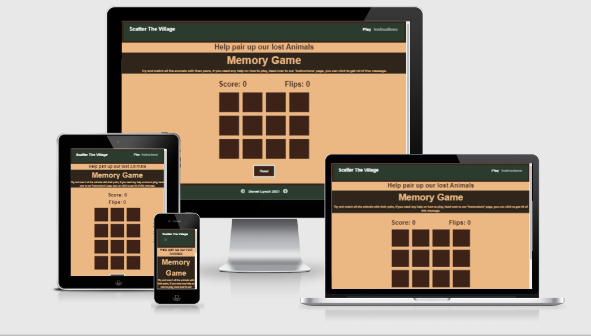

# Scatter-The-Village
Scatter the Village is an online card memory game. The site is targeted at users of all ages that enjoy logic-based games, it has a village theme that is friendly to those of all ages.

## Demo
A live demo can be found [here](https://lynch4360.github.io/Scatter-The-Village/)

## View the repository
The repository can be found [here](https://github.com/Lynch4360/Scatter-The-Village)

## UX

## Website owner business goals

* I would like my visitors to be able to navigate the website easily and intuitively.
* I would like the game to be entertaining for visitors.
* I would like the game to test the user's memory abilities and give them a challenge.

### Ideal Client

#### The ideal client for this business is:
* Of any age.
* Someone who enjoys logic-based games.
* Someone who is looking to test their memory.

#### Visitors of this website are looking for:

* Somewhere they can test their memory and decision-making skills in a fun and upbeat manner.

#### This project is the best way for them to achieve this because:

* It is an upbeat fully functional memory game that can be played on all device types.
* It puts your memory and decision-making skills to the test.

### User Stories
#### New user goals:
* As a first-time user, I want to challenge my memory abilities, so that I can strengthen the logical thinking part of my brain.
* As a first-time user, I want the website to be intuitively designed so that I can navigate it easily.
* As a first-time user, I want to be able to use any device type so that I can play the game anywhere that is convenient to me.
* As a first-time user, I want clear instructions on how to play the game, so that I can waste no time and jump right into testing my memory.
#### Returning user goals:
* As a returning user, I want to be able to skip the instructions and be able to play the game straight away.
* As a returning user, I want to be able to access the social media links.

##### Wireframes Mockups:
- [Phone](readme/mobileWireframe.png)
- [Tablet](readme/tabletWireframes.png)
- [Desktop Play Page](readme/playDesktopWireframe.png)
- [Desktop Instructions Page](readme/instructionsDesktopWireframe.png)

## Features
The site features a Navigation bar and footer that is uniform on both pages.
The Navigation bar changes to a hamburger icon used for navigating pages when on smaller screen sizes.

The site features a footer with copyright information and link to the developer's GitHub.

### Play

The play page features an overlay that is removable on click, this overlay contains a small amount of flavor text for the game and an abbreviated form of the instructions.

After the Overlay, there are some game information stats. A score that will increment and decrement as the user flips the cards. Every time they get a match is +50 score and every time they pick the wrong set of cards they will be deducted 10 points.

Finally, there is the game which is resized depending on the user's screen size. The game has 12 cards, which begin to turn around with a blank background on them. These cards will flip on click.

### Instructions

The Instructions page features some flavor text to give some story and theme to the site. Alongside this, there is a button in the style of a Minecraft sign. This button will bring the user back to the game page.

After this, there is a paragraph of instructions with some more theme-orientated flavor text. 
Alongside this, there is an image of a pixelated town. This is for visual purposes only and was added to improve the overall aesthetic of the site.

Finally, we come to the "Did you know?" section where there are 3 facts about the different types of memory games that have existed through the years. This section also contains an interesting titbit about Mark Twain. More information on Mr. Twain can be found [here](https://en.wikipedia.org/wiki/Mark_Twain)

### Existing features
- [Header Logo](readme/headerLogo.png) - Exists on every page and allows users to easily recognize the business brand. Clicking the logo returns users to the home page as they would expect.
- [Header Navigation Bar](readme/navbarDesktop.png) - Exists on every page and allows all users to easily navigate both of the web site's pages and find what they are looking for quickly.
- [Footer Copyright and Github Icons](readme/footer.png) - Exists on every page allows users to connect with the maker of the site and protects the business copyright.
- [Memory game](readme/gameDesktop.png) - Exists on play page allows users to play the game and will also get resized for different screen sizes
- [Button to the game](readme/buttonToGame.png) - Exist on Instructions page allows the user to navigate quickly to the play page, it also adds a nice aesthetic to the site.
- [Instructions to the game](readme/instructionsDesktop.png) - Exists on Instructions page allows the user to fully comprehend the rules. The reason this is not the landing page is for good UX design. Now the user can come back to the site repeatedly and not have to change the page to play the game.

#### Screenshots of final site
- [Desktop Play Page](readme/dt_play_page.png)
- [Desktop Instructions Page](readme/dt_instruction.png)
- [Tablet Play Page](readme/tbl_play.png)
- [Tablet Instructions Page](readme/tblt_instructions.png)
- [Mobile Play Page](readme/mobile_play.png)
- [Mobile Instructions Page](readme/mobile_instructions.png)

### Features left to implement

* In the future I would like to
* Increasing levels of difficulty.
* Audio for card flips and for every time that you match up a pair of animals.
* A feature where people can write their name before a game and it will show up on a leaderboard on a different page.

## Technologies
[Javascript](https://en.wikipedia.org/wiki/JavaScript) was used for the game itself. Flipping of the cards, checking for match, etc.

[Bootstrap (5.0.1)](https://en.wikipedia.org/wiki/Bootstrap_%28front-end_framework%29) was used for setting up a grid to help make the site uniform and responsive, quickly and easily.

[HTML](https://en.wikipedia.org/wiki/HTML) was used as the markdown for the Play and Instruction pages

[CSS](https://en.wikipedia.org/wiki/Cascading_Style_Sheets) was used to style the site.

[Markdown](https://en.wikipedia.org/wiki/Markdown) was used in the writing of this document.

# Testing
## Functionality Testing
    I used Google Chrome developer tools throughout the development process for testing and solving problems with Padding, Margin, and most Style issues.
    All links, albeit the few that are on the site, were tested multiple times during the development process to ensure that all pages were linked correctly.
    Friends and family members also used the site once it was deployed and they gave feedback.

## Code Validation
    The W3C Markup Validator and W3C Validator services were used to validate every page of the project to ensure there were no syntax errors in the project.

## User Stories Testing
New user: 

* As a first-time user, I want to challenge my memory abilities, so that I can strengthen the logical thinking part of my brain.
    - Every time the game is refreshed the cards are in a different place making each game different.
* As a first-time user, I want the website to be intuitively designed so that I can navigate it easily.
    - The navigation bar allows the user to easily and intuitively move between the various pages, the landing screen is the game, not the instructions. This is set up with the thought in mind that the user will only need the instructions once, after that they will only return to play the game.
* As a first-time user, I want to be able to use any device type so that I can play the game anywhere that is convenient to me.
    - The site has been developed with responsivity in mind, it is easily accessible and playable on all device types.
* As a first-time user, I want clear instructions on how to play the game, so that I can waste no time and jump right into testing my memory.
    - There is a dedicated instructions page with information about the game, and also an overlay with an abbreviated version of these instructions on the play game page itself.

Returning User: 
* As a returning user, I want to be able to skip the instructions and be able to play the game straight away.
    - The play game page is the landing page so the instructions are skipped by default, this is a better UX design than forcing the user to see the instructions page every time they want to play the game.
* As a returning user, I want to be able to access the social media links.
    - Users can access any social media links in the footer at the bottom of every page.

### Known bugs
#### There is only one known bug:
- The randomizer on the reset function does not work properly. The cards will get placed back on the board but they will stay in the same spot until the browser is refreshed.

### I tested the website on the following browsers using a Chuwi HeroBook Pro and a Custom built PC (intel i7 6700k, GTX 1070ti).

* Google Chrome-Version 90.0.4430.212 (Official Build) (64-bit)

* Firefox-Version 88.0 (64 bit)

* The website was fully functional on all of these browsers. All navigation links worked. The screens responded to different screen widths. All of the links in the footer worked.

* The website was also tested on a Huawei P30 running Android 11.

## Screenshot of The Validation
[index.html](readme/IndexValidation.png) No issues were found 
[style.css](readme/cssValidation.png) No issues were found 
[instruction.html](readme/InstructionValidation.png) No issues were found 
[script.js](readme/jsValidation.png) Some warnings found, They were about ES6 these were not a worry and can be ignored. The two undefined Variables in the screenshot are of no concern and are just a 'jshint' issue. 

# Deployment
    The project was deployed to GitHub Pages using the following steps, I used Gitpod as a development environment where I committed all changes to Git version control system. I used the push command in Gitpod to save changes into GitHub:

    1. Log in to GitHub and locate the GitHub Repository.
    2. At the top of the Repository, click on the "Settings" button on the menu.
    3. Scroll down the Settings page until you locate the "Pages" Section.
    4. Under "Source", click the dropdown called "None" and select "Master Branch" and click on save.
    5. The page will automatically refresh.
    6. The now published site link shows at the top of the page.

The live site can be found [here](https://lynch4360.github.io/Scatter-The-Village/)

    To run locally:

    1. Log in to GitHub and click on 'repository' to download.
    2. Select Code and click Download the ZIP file.
    3. After download you can extract the file and use it in your local environment.
    4. Alternatively you can Clone or Fork this repository into your GitHub account.

## Credits

All CSS and HTML code was written by the developer.
The JavaScript code for the game was written by the developer, although inspiration was acquired from it.
 [Port.exe's video](https://www.youtube.com/watch?v=3uuQ3g92oPQ&t=1503s) - [Ania Kubow's video](https://www.youtube.com/watch?v=tjyDOHzKN0w&t=180s)

The "Did you know?" facts were acquired from:
[here](https://www.wordhippo.com/what-is/the-meaning-of/japanese-word-b3fd060f3ec53befe0cb3b6455590959b79b3393.html) and [here](https://en.wikipedia.org/wiki/Concentration_(card_game))

### Content

* The color scheme was picked using [Canva](https://www.canva.com/colors/color-palettes/)

* A Simple "sans-serif" font was used and "DotGothic" was used for the 'Play Now' sign on the instructions page.

* The flavor text for the Play page and the Instruction page was created by the developer.

### Media
* All images were obtained from [Pixabay]()

### Acknowledgements
    I received support, advice, and feedback from my Mentor Brian Macharia.
    The Students in the Code Institute slack channels for their review and comments.

## [Back to the Start](https://github.com/Lynch4360/Scatter-The-Village)
